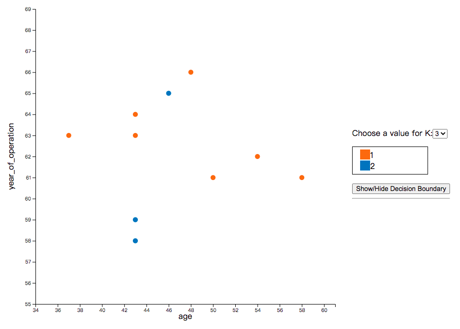

# knn-js
* Clickable/Interactive [k-NN algorithm](https://en.wikipedia.org/wiki/K-nearest_neighbors_algorithm) in javascript 
* It can be integrated into a web application

# Setup

Include the libraries, `knn-js` is based on [d3](https://d3js.org/)

```html
<script src="https://d3js.org/d3.v4.min.js"></script>
<script src="../dist/knnjs.min.js"></script>
<link rel="stylesheet" href="../dist/knnjs.min.css" />
```

## CDN - UNPKG
* TODO

# Usage
## Hello World example
Create an element to hold the table

```html
<div id="myknn"></div>
```

Turn the div element into a d3 scatter chart with some simple javascript

```javascript
var myknn = knnjs.knn();
myknn.init(document.getElementById("myknn"), {
  selectedDataSet: [
    {age: 37, year_of_operation: 63, positive_axillary_nodes: 0, survival_status: 1},
    {age: 43, year_of_operation: 58, positive_axillary_nodes: 52, survival_status: 2},
    {age: 43, year_of_operation: 59, positive_axillary_nodes: 2, survival_status: 2},
    {age: 43, year_of_operation: 63, positive_axillary_nodes: 14, survival_status: 1},
    {age: 43, year_of_operation: 64, positive_axillary_nodes: 2, survival_status: 1},
    {age: 46, year_of_operation: 65, positive_axillary_nodes: 20, survival_status: 2},
    {age: 48, year_of_operation: 66, positive_axillary_nodes: 0, survival_status: 1},
    {age: 50, year_of_operation: 61, positive_axillary_nodes: 0, survival_status: 1},
    {age: 54, year_of_operation: 62, positive_axillary_nodes: 0, survival_status: 1},
    {age: 58, year_of_operation: 61, positive_axillary_nodes: 2, survival_status: 1}
  ], 
  colorMap: {
    "1": "#EE7733",
    "2": "#0077BB"
  },
  selectedColumns: ["age", "year_of_operation"], 
  categoryName: "survival_status"
});
```



Take a look at [examples/hello.html](https://github.com/study-ml/knn-js/blob/main/examples/hello.html) for more information


# TODO
* use `webpack` to build
* publish to npm and `CDN - UNPKG`
* remove `charttable.min.js` once we can publish to npm
 
